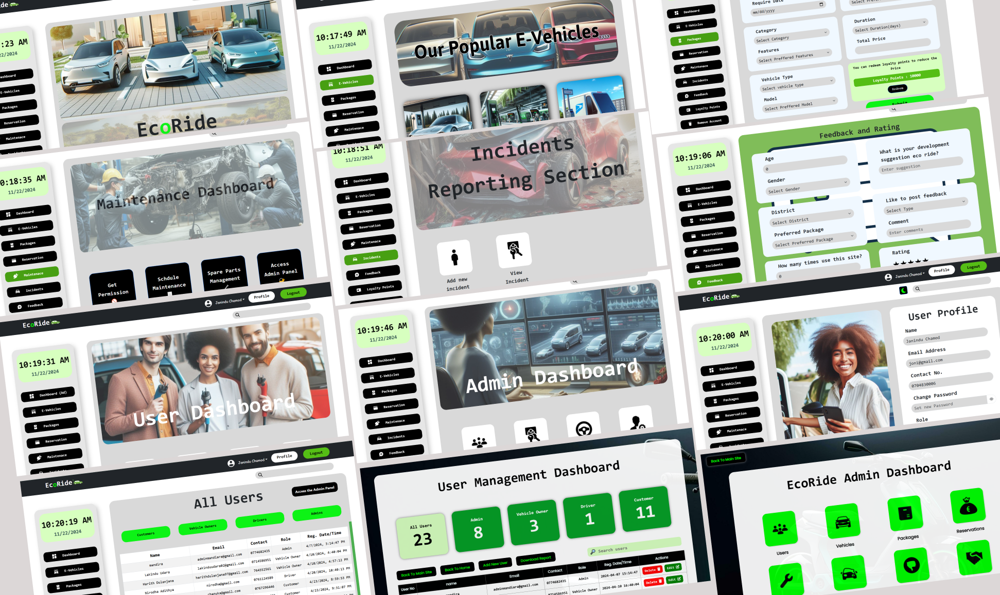

# EcoRide 🚗⚡🍃
Revolutionizing the E-Vehicle Renting Experience



## Overview
EcoRide is a comprehensive e-vehicle renting system designed to provide a seamless and user-friendly experience for individuals and businesses seeking to rent electric vehicles. The system is tailored to ensure efficient management, transparency, and sustainability, with advanced tools to manage users, vehicles, reservations, and more. Leveraging the power of modern technologies such as the MERN stack, Vite, Redux, JWT, and Firebase, EcoRide ensures scalability, high performance, and robust security.

## Core Features
EcoRide is built around 8 essential components that ensure smooth operations and exceptional service delivery:

1. User Management
- Secure user registration and login with JWT-based authentication.
- Role-based access control for users and administrators.
- Edit and manage user profiles, rental history, and preferences.

2. Vehicle Inventory Management
- Maintain a real-time catalog of available vehicles.
- Add, update, or remove vehicles with detailed specifications such as type, model, and condition.
- Real-time availability tracking to ensure optimized inventory utilization.

3. Vehicle Package Management
- Create flexible and customized rental packages based on time, distance, or usage type.
- Offer promotions, discounts, and seasonal deals to attract customers.
- Easy configuration of pricing models for short-term and long-term rentals.

4. Vehicle Reservation Management
- Enable users to browse and reserve vehicles in real time.
- Manage reservations with options to view, modify, or cancel bookings.
- Admin dashboard to oversee reservations and resolve conflicts.

5. Vehicle Maintenance Management
- Schedule routine maintenance and keep vehicles in top condition.
- Maintain detailed logs of maintenance history for each vehicle.
- Generate automated alerts for upcoming service requirements.

6. Damage and Incident Management
- Allow users to report damages or incidents during rental periods.
- Maintain detailed records of damages, repairs, and insurance claims.
- Enable administrators to handle incidents quickly and efficiently.

7. Feedback and Rating Management
- Enable users to leave feedback and rate vehicles or services.
- Aggregate ratings to ensure transparency and guide service improvements.
- Utilize user feedback to improve overall user satisfaction.

8. Customer Loyalty Management
- Reward loyal users with points, discounts, or exclusive offers.
- Track and manage loyalty programs to increase customer retention.
- Provide perks such as early access to vehicles or discounted rentals.

## Technologies Used
EcoRide is developed using modern and reliable technologies to ensure a seamless experience:

`` MERN Stack (MongoDB, Express.js, React, Node.js): For backend and frontend development.``

`` Vite: For fast and efficient frontend development.``

`` Redux: For state management.``

`` JWT (JSON Web Tokens): For secure authentication and authorization.``

`` Firebase: For real-time database management, notifications, and analytics.``

```env
NODE_ENV=
PORT=
MONGO_URI=
JWT_SECRET=
```
